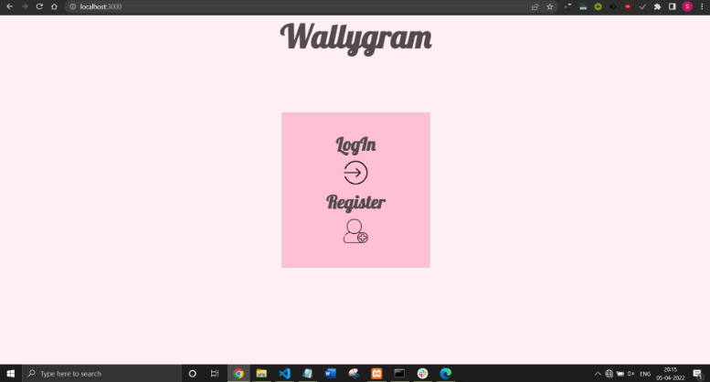
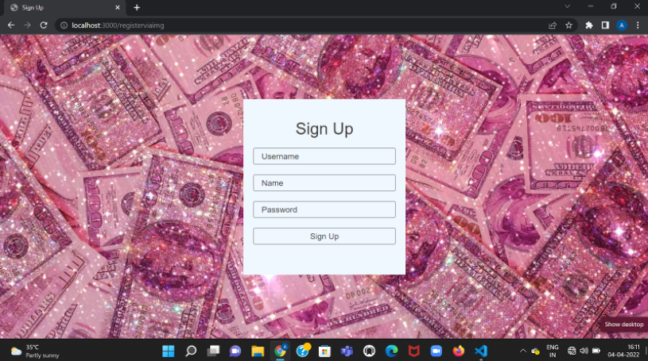
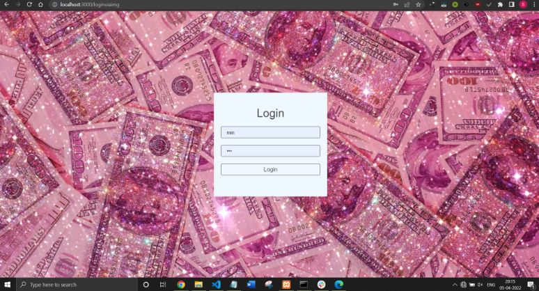
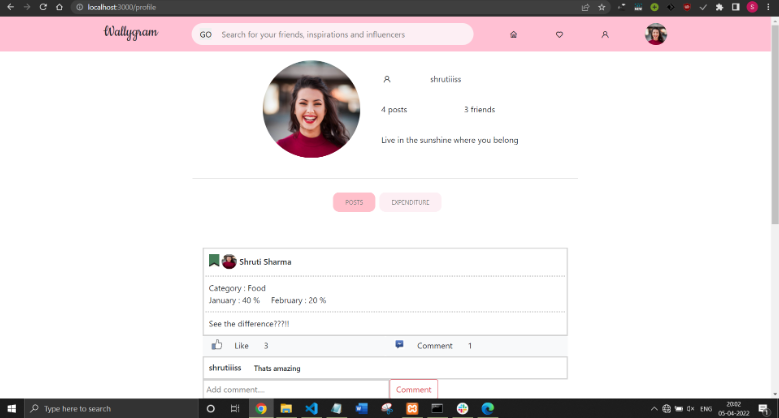
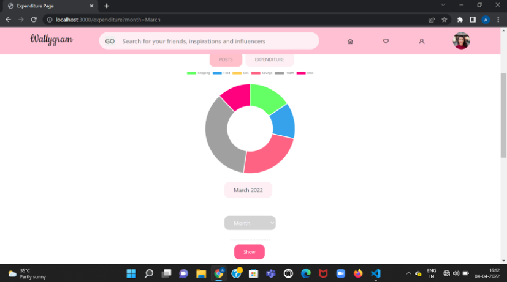
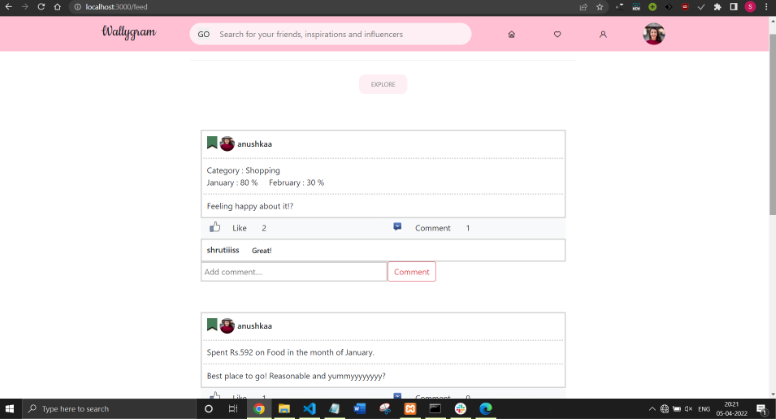
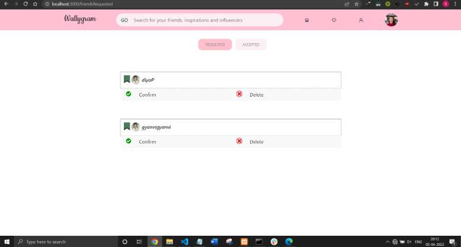
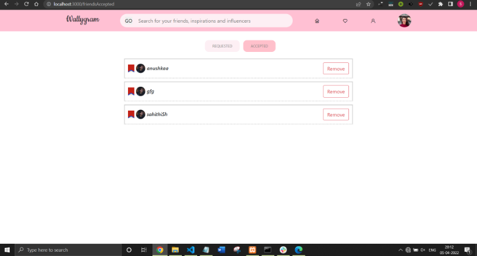

# WALLYGRAM

An expenditure management and expense sharing platform among friends, combining social media with wallet analysis.

## Contributors
* Anushka Srivastava
* Shruti Sharma
* Gyanvi
* Diya Pancholi
* Siddam Shetty Sahithi Shresta

## Running

1.  Clone this repo and run `npm install`
2.  Create a database using wallygramdb.sql file
3.  Create a user in Mysql with username : root and enter password in constants.json file.
4.  Then start the server by `npm start`

## Snippets

### First page

### Sign Up Page

### Login Page

### Profile Page

### Expenditure Page

### Comparison and Category Posts Page

### Feed Page

### Friends Requested Page

### Friends Accepted Page

